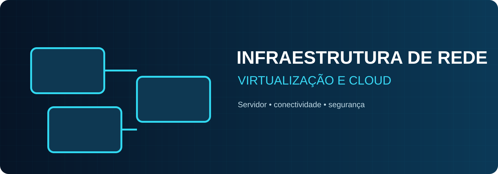
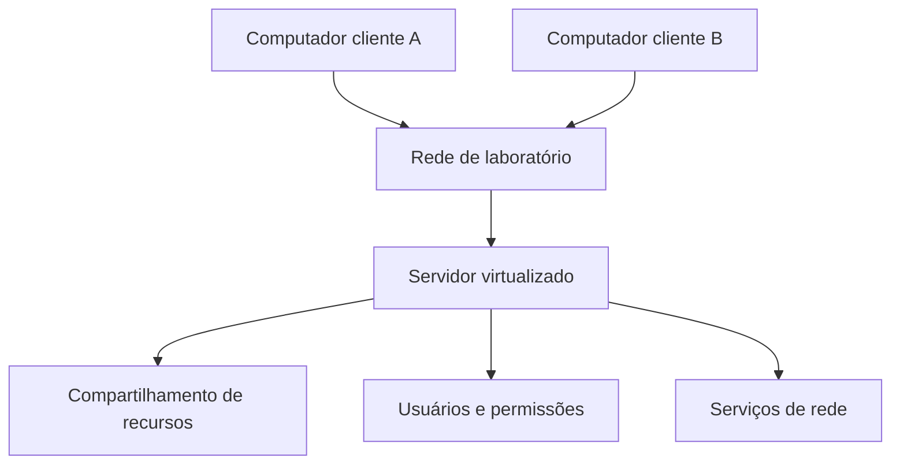
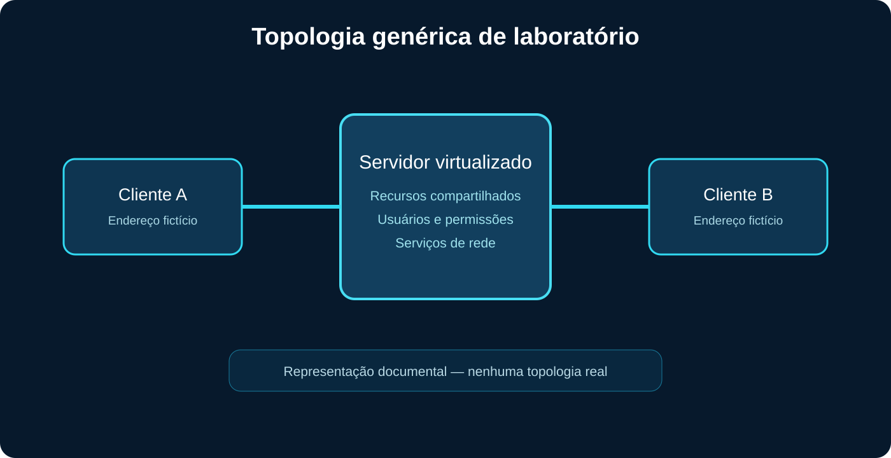

<p align="center"></p>

# Infraestrutura de Rede Virtualizada em Cloud

Projeto de infraestrutura tecnológica voltado à integração de computadores por meio de um servidor virtualizado, com aplicação de fundamentos de redes, sistemas operacionais, administração e segurança.

## Problema

Ambientes computacionais precisam compartilhar recursos e manter comunicação organizada entre diferentes máquinas. Sem uma infraestrutura central, o controle de acesso, a administração e a disponibilidade dos serviços tornam-se mais difíceis.

## Objetivo

Estruturar um servidor em ambiente virtualizado e integrar computadores clientes, aplicando conceitos de conectividade, serviços de rede, controle de acesso e administração de sistemas.

## Solução desenvolvida

Um servidor virtualizado centralizou a comunicação e os recursos do laboratório. Os computadores clientes foram integrados por uma rede controlada, permitindo aplicar conceitos de endereçamento, compartilhamento e permissões.



## Topologia genérica



Os nomes, endereços e serviços representados são exemplos fictícios. Nenhum dado operacional ou militar foi reproduzido.

## Componentes

- computador hospedeiro;
- servidor em ambiente virtualizado;
- dois computadores clientes representativos;
- rede privada de laboratório;
- compartilhamento controlado de recursos;
- usuários e permissões;
- fundamentos de serviços de rede e segurança.

## Tecnologias e conhecimentos

- redes TCP/IP;
- virtualização;
- sistemas operacionais;
- administração de servidores;
- compartilhamento de recursos;
- controle de acesso;
- fundamentos de cloud computing;
- segurança da informação.

Python e SQL não são atribuídos ao projeto por falta de confirmação.

## Segurança e confidencialidade

- nenhuma unidade, endereço ou pessoa é identificada;
- nenhum IP ou nome de host real é utilizado;
- a topologia é ilustrativa;
- não existem credenciais ou configurações operacionais;
- o conteúdo permanece no nível acadêmico e conceitual.

## Organização

```text
├── assets/                         # capa, topologia e miniatura
├── docs/
│   ├── arquitetura.md
│   ├── servicos-de-rede.md
│   └── seguranca-e-limitacoes.md
├── SECURITY.md
├── LICENSE
└── README.md
```

## Resultados e aprendizados

O projeto proporcionou experiência prática na integração de computadores, centralização de recursos, organização de uma rede e administração de um ambiente virtualizado. Também reforçou a importância de controle de acesso, documentação e proteção de informações de infraestrutura.

Não são apresentados indicadores quantitativos porque os registros de medição originais não estão disponíveis.

## Melhorias futuras

- reconstruir o laboratório em um simulador público;
- comparar diferentes hipervisores;
- documentar DHCP e DNS em um ambiente reproduzível;
- incluir monitoramento de disponibilidade;
- demonstrar backup e recuperação;
- implantar uma versão acadêmica em provedor de nuvem.

## Autor

**Sandro Ferreira**

[LinkedIn](https://www.linkedin.com/in/sandrozdb/) · [GitHub](https://github.com/sandrozdb)

## Licença

Distribuído sob a licença MIT. Consulte [LICENSE](LICENSE).
